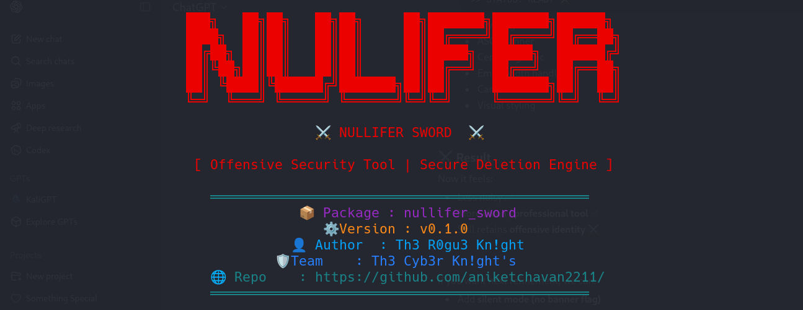

# ⚔️ NULLIFER SWORD



A high-performance, secure file shredder written in Rust — designed for precision, speed, and reliability.


## 🧠 Overview

**Nullifer Sword** is a modern, multi-threaded file shredding utility built in Rust.  
It ensures data destruction through:

- 🔐 Multi-pass overwrite
- ⚡ Parallel processing (CPU + IO optimized)
- 🧠 Memory zeroization
- 📁 Recursive directory shredding
- 📊 Real-time progress tracking
- 🎨 Clean CLI with structured logging


## ⚙️ Features

### 🔥 Core Capabilities

- Secure file shredding with configurable overwrite passes
- Recursive directory processing
- Parallel execution using thread pools (`rayon`)
- Safe memory wiping (`zeroize`)
- Progress bars (`indicatif`)
- Structured logs (`env_logger + colored`)


### ⚔️ Modes

| Mode      | Description |
|----------|------------|
| `shred`  | Overwrite + delete files/directories |
| `wipe`   | Overwrite only (no deletion) |
| `verify` | Check if file still exists |


## 🏗️ Architecture

```
src/
├── main.rs
├── cli.rs
├── banner.rs
├── utils.rs
└── shredder/
    ├── engine.rs
    ├── file.rs
    ├── dir.rs
    ├── verify.rs
    └── mod.rs
```


## 🚀 Installation

```bash
git clone https://github.com/aniketchavan2211/nullifer_sword
cd nullifer_sword
cargo build --release
```


## 🧪 Usage

```bash
./target/release/nullifer_sword shred tests/secret.txt
```


## ⚙️ Options

| Flag | Description |
|------|------------|
| `-r, --recursive` | Process directories |
| `-p, --passes` | Overwrite passes (default: 3) |
| `--parallel` | Enable parallel processing |


## 📊 Example Output

```
[INFO] Target received: secret.txt
[INFO] Detected file target
[INFO] Shredding file: secret.txt
[INFO] File size: 4096 bytes
[OK] File deleted: secret.txt
```

---

<p align="center">

## 👤 Author  
<b>Th3 R0gu3 Kn!ght</b>

</p>

<p align="center">

## 🛡️ Team  
<b>Th3 Cyb3r Kn!ght's</b>

</p>

<p align="center">

## 🌐 GitHub  
<a href="https://github.com/aniketchavan2211">
  
</a>

</p>

<p align="center">

## 📜 License  


</p>

---
